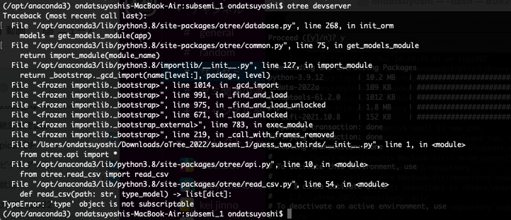
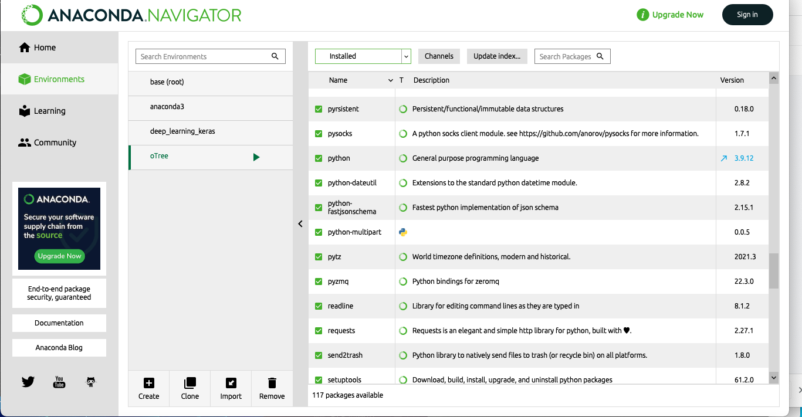

# otreeを5.8.2にアップデートし、otree devserverをするとType errorが発生
ひさしぶりにotreeを使うことになったのでアップデートしたところ動かなくなった

## 環境
Anaconda: 4.10.3  
Anaconda Navigator: 2.0.3  
Python: 3.8.8   
oTree: 3.1.1 → 5.8.2  
## 結論:Python 3.9の別の仮想環境を作成することで解決
`conde create -n 環境名 python=3.9  `

・GUI側からだと3.9は作れないのでターミナルから行う

無事にGUI上でも確認できた
## 原因: otree5はPython3.8に対応していない
・エラーをよく見たらPython側ぽかった.
